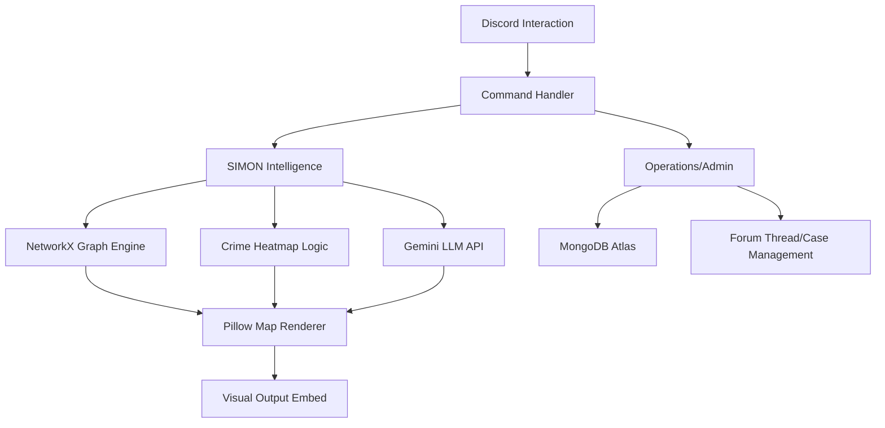

# Metropolitan Division Services (S.I.M.O.N.)

A high-performance, AI-driven tactical and administrative suite designed for ER:LC Metropolitan Division operations. This project integrates graph theory, behavioral modeling, and Large Language Models (LLMs) to provide real-time predictive policing and division management.

## 🧠 The S.I.M.O.N. Predictive System

S.I.M.O.N. (**S**ystemic **I**ntelligence for **M**etropolitan **O**perational **N**etworks) is the core engine of this bot. It doesn't just track the history of a suspect, it anticipates future movements using:

*   **Graph Engine (NetworkX):** A full digital twin of the ER:LC road network, utilizing Dijkstra's algorithm with dynamic weights based on road hierarchy (Highways, Local, Industrial).
*   **Behavioral Modeling:** Adjusts route costs based on historical suspect data, frequency of crimes at specific Points of Interest (POIs), and "Panic Factors" caused by unwhitelisted unit pressure.
*   **AI Synthesis (Gemini API):** Processes raw incident data to generate structured tactical predictions, primary/secondary target identification, and risk assessments.

### Key Intelligence Features
*   **Predictive Routing:** Generates visual map overlays with optimal intercept paths.
*   **Crime Heatmapping:** Aggregates MongoDB logs to render spatial intensity maps of recent criminal activity.
*   **Suspect Profiling:** Automates the extraction of vague location descriptions into structured data and builds long-term behavioral dossiers.
*   **Active Watchlist:** An automated, hourly-updating intelligence board highlighting high-frequency offenders.
*   **Organized Crime Intelligence:** Dedicated tracking for the principle criminal factions (NSH, WCC, 77th), including M.O. summaries and affiliate metrics.

## 🛡️ Operational Command Tools

Beyond intelligence, the bot serves as the central administrative hub for the Metropolitan Division:
*   **Case Management:** Integrated forum-based case tracking for Major Crimes (MCS), allowing detectives to log evidence, suspect descriptions, and vehicle data to specific Case IDs.
*   **Rapid Reporting:** Uses Natural Language Processing to generate detailed After Action Reports from a single unstructured message.
*   **Intel Points & Shop:** A gamification system rewarding high-quality intelligence gathering. Officers can redeem points for shift credits, quota exemptions, and tactical hints.
*   **Automated Roster/Openings:** Real-time tracking of rank quotas and current officer assignments.
*   **Administrative Logging:** Standardized systems for promotions, infractions, and training evaluations.
*   **Personal File Linking:** Officers can link their reporting threads (AARs, K9 logs) to their Discord profile for automated report routing.

## 🕹️ Command Reference

### Intelligence (SIMON) Commands
| Command | Description |
| :--- | :--- |
| `/metro_predict` | Runs the full predictive engine (LKL, Vehicle, Context). |
| `/metro_suspect_log`| Logs criminal activity; uses AI to resolve vague locations. |
| `/metro_profiler` | Generates a 20-log history and behavioral analysis for a suspect. |
| `/metro_crime_heatmap`| Renders a visual map of historical activity. |
| `/metro_watchlist` | Displays the top 6 most active suspects and Organized Crime Analytics. |
| `/metro_intel_profile`| View detailed Intel Point history for any officer. |
| `/metro_leaderboard` | View the top intelligence point earners for the current cycle. |

### Operations & Admin Commands
| Command | Description |
| :--- | :--- |
| `-metroAA [text]` | **Rapid AAR:** Generates a full report from unstructured text input. |
| `/metro_dashboard` | Master control panel for routing and permissions (Owner Only). |
| `/metro_shop` | Opens the rewards menu to redeem Intel Points. |
| `/metro_raffle` | Shows your current weekly raffle tickets and draw odds. |
| `/metro_start_case` | Initializes a major crimes case thread in the division forum. |
| `/metro_active_cases`| Directory of all ongoing Major Crimes investigations. |
| `/metro_case_log` | Appends evidence, photos, and notes to an active Case ID. |
| `/metro_after_action`| Standardized AAR; routes to personal threads if linked. |
| `/k9_deploy` | Logs K9 deployments with evidence attachments. |
| `/metro_openings` | Displays current rank availability and member list. |
| `/metro_link` | Links/Unlinks personal reporting threads for AAR/K9 routing. |
| `/metro_start_live` | Builds a live operation plan and posts the readiness board to the configured channel. |
| `/metro_log_training`| Opens a score-entry modal for evaluating trainees. |
| `/host_metro_training`| Announces and handles reactions for a training session. |
| `/metro_weekly_stats`| Division-wide analytics for the current operational period. |
| `/metro_new_week` | Archives logs and resets weekly counters (High Command Only). |
| `/metro_mass_shift` | Division-wide mobilization alert. |
| `/metro_promote` | Formally logs and pings an officer promotion. |
| `/metro_infract` | Formally logs and pings a disciplinary action. |
| `/request_metro` | Cross-division request for Metro/SWAT backup. |
| `/metro_modify_points`| Manually adjust officer points (High Command Only). |

## 🛠️ Technical Architecture



### Tech Stack
*   **Language:** Python 3.11+
*   **Framework:** `discord.py` (App Commands)
*   **Database:** MongoDB Atlas (via `Motor` for async I/O)
*   **Mathematics:** `NetworkX` for graph computation
*   **Imaging:** `Pillow` (PIL) for real-time map generation
*   **AI:** Google Gemini 1.5 Flash (for structured JSON extraction and analysis)

## 🚀 Setup & Installation

### 1. Prerequisites
*   A MongoDB Atlas Cluster.
*   A Google AI Studio (Gemini) API Key.
*   A Discord Bot Token with `Members` and `Message Content` intents enabled.

### 2. Configuration
Create a `.env` file in the root directory:
```env
DISCORD_TOKEN=your_token_here
MONGO_URI=your_mongodb_connection_string
GEMINI_API_KEY=your_gemini_api_key
WATCHLIST_CHANNEL_ID=your_discord_channel_id
```

### 3. Installation
```bash
# Clone the repository
git clone https://github.com/your-repo/ai-suspect.git
cd ai-suspect

# Install dependencies
pip install -r requirements.txt

# Run the bot
python main.py
```

## 🧪 Testing
The project includes a robust suite of over 100 tests covering graph loading, routing accuracy, ETA calculations, and embed construction.
```bash
pytest --tb=short -v
```
